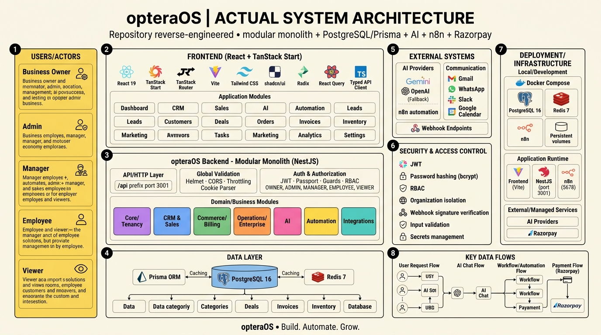

# opteraOS

> **Build. Automate. Grow.**

A modular, multi-tenant business operating system built with **React + TanStack Start**, **NestJS**, **PostgreSQL/Prisma**, **AI (Gemini/OpenAI)**, **n8n**, and **Razorpay**.

---

## System Architecture



---

## Tech Stack

| Layer | Technologies |
|---|---|
| **Frontend** | React 19, TanStack Start, TanStack Router, Vite, Tailwind CSS, shadcn/ui, Radix UI, React Query |
| **Backend** | NestJS (Modular Monolith), REST API, JWT + Passport, RBAC |
| **Database** | PostgreSQL 16 (primary), Prisma ORM, Redis 7 (caching) |
| **AI** | Gemini (primary), OpenAI (fallback) |
| **Automation** | n8n (direct integration) |
| **Payments** | Razorpay |
| **Communication** | Gmail, WhatsApp, Slack, Google Calendar |
| **Infrastructure** | Docker Compose, persistent volumes |

---

## Application Modules

- **CRM & Sales** — Contacts, Companies, Leads, Deals, Pipelines, Quotations
- **Commerce / Billing** — Orders, Products, Invoices, Payments, Subscriptions, Pricelists
- **Operations / Enterprise** — Tasks, Activities, Inventory, Projects, Manufacturing, Purchase, HR/Employees, Helpdesk, Discuss
- **AI** — AI Assistant, Conversations, Messages, Tool Calling, Business Context
- **Automation** — Workflows, Workflow Executions, Event Triggers, n8n Integration
- **Integrations** — Integration Service, Gmail/WhatsApp, Slack/Calendar, Webhooks
- **Core / Tenancy** — Organizations, Users, OrgMembers, Tasks, Custom Fields, Comments, Attachments, Departments/Teams

---

## Key Data Flows

1. **User Request** — `Browser → Frontend (React+TanStack) → NestJS API → Prisma → PostgreSQL`
2. **AI Chat** — `User → AI Assistant Module → AI Service (NestJS) → Gemini/OpenAI → Business Data (PostgreSQL)`
3. **Workflow/Automation** — `Event (lead created, etc.) → Automation Module → WorkflowExecution (PostgreSQL) → n8n → External Action`
4. **Payment (Razorpay)** — `User (checkout) → Backend (create order) → Razorpay → Webhook (HMAC verify) → Payment/Invoice/Subscription → PostgreSQL`

---

## Security & Access Control

- **JWT** (access + refresh tokens)
- **Password hashing** (bcrypt)
- **RBAC** — `OWNER`, `ADMIN`, `MANAGER`, `EMPLOYEE`, `VIEWER`
- **Organization isolation** (multi-tenant)
- **Webhook signature verification**
- **Input validation & sanitization**
- **Secrets/environment variables management**

---

## Getting Started

### Prerequisites

- Node.js 18+
- Docker & Docker Compose
- PostgreSQL 16
- Redis 7

### Installation

```bash
# Clone the repository
git clone https://github.com/ayukaushik1357-bit/opteraOS.git
cd opteraOS

# Install backend dependencies
cd backend
npm install

# Install frontend dependencies
cd ../frontend
npm install
```

### Running with Docker Compose

```bash
cd backend
docker-compose up -d
```

This starts:
- **PostgreSQL 16** — primary database
- **Redis 7** — caching
- **n8n** (port 5678) — automation engine (optional)

### Running Locally

```bash
# Backend (port 3001)
cd backend
npm run start:dev

# Frontend (Vite dev server)
cd frontend
npm run dev
```

### Environment Setup

Copy the example env file and fill in your credentials:

```bash
cd backend
cp .env.example .env
```

---

## Project Structure

```
opteraOS/
├── backend/                  # NestJS modular monolith
│   ├── src/
│   │   ├── modules/          # Feature modules (CRM, AI, Billing, etc.)
│   │   ├── common/           # Guards, decorators, interceptors
│   │   └── app.module.ts
│   ├── prisma/
│   │   ├── schema.prisma     # Database schema
│   │   └── seed.ts
│   └── docker-compose.yml
├── frontend/                 # React + TanStack Start
│   ├── src/
│   │   ├── routes/           # File-based routing
│   │   ├── components/       # UI components
│   │   └── lib/              # API clients, utilities
│   └── vite.config.ts
└── docs/
    └── architecture.jpg      # System architecture diagram
```

---

## License

MIT
